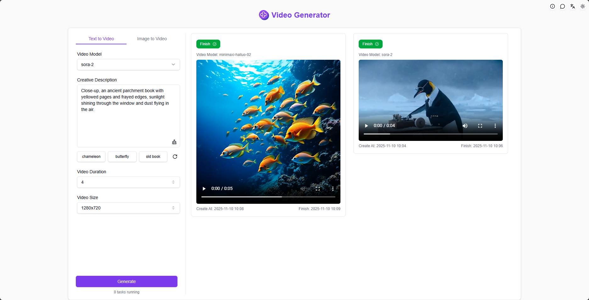
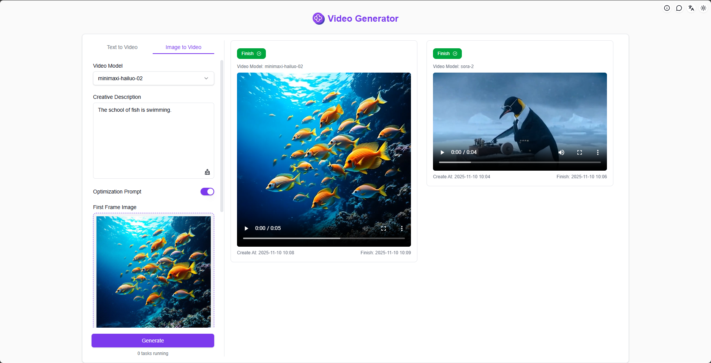
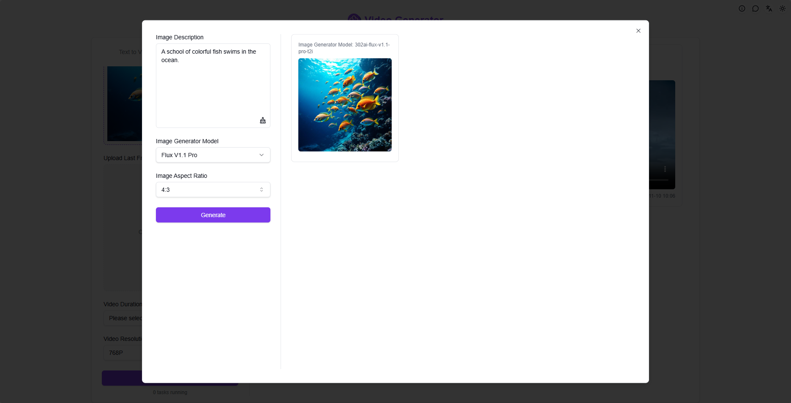

# <p align="center"> 🎬 AI Video Generator 🚀✨</p>

<p align="center">The AI Video Generator produces high-quality AI videos from text and images using industry-leading video models such as Luma, Runway gen-3, Kling, and CogVideoX.</p>

<p align="center"><a href="https://302.ai/product/detail/26" target="blank"></a></p >

<p align="center"><a href="README_zh.md">中文</a> | <a href="README.md">English</a> | <a href="README_ja.md">日本語</a></p>


This is the open-source version of the [AI Video Generator](https://302.ai/product/detail/26) from [302.AI](https://302.ai/en/). You can directly log in to 302.AI to use the online version with zero code and zero background, or modify and deploy it yourself according to your requirements.

## Interface Preview
Select a video model, enter the prompt, set the parameters, and generate a high-quality AI video with one click.


Upload a local image or an AI-generated image, enter the prompt and set the parameters, and generate a high-quality AI video.
           

Generate images using various AI models, and use the generated images for AI video creation with one click.


## Project Features
### 🧩 Multi-model Support
    Different configuration options can be provided for each model, including camera control and video effects.
### 🎛️ Multiple Modes
    Offers two modes: text-to-video and image-to-video, which can be selected as needed.
### 🖼️ AI Image Generation
    Generate AI images with one click and use them for video creation.
### 📜 History Records
    Your creative history is saved, never lost, and can be downloaded anytime, anywhere.
### 🌓 Dark Mode
    Easily switch to protect your eyes.
### 🌍 Multi-language Support
- Chinese Interface
- English Interface
- Japanese Interface

## 🚩 Future Update Plans
- [ ] Add more video models

## 🛠️ Tech Stack

- **Framework**: Next.js 14
- **Language**: TypeScript
- **Styling**: TailwindCSS
- **UI Components**: Radix UI
- **State Management**: Jotai
- **Form Handling**: React Hook Form
- **HTTP Client**: ky
- **i18n**: next-intl
- **Theming**: next-themes
- **Code Standards**: ESLint, Prettier
- **Commit Standards**: Husky, Commitlint

## Development & Deployment
1. Clone the project
```bash
git clone https://github.com/302ai/302-video-generator-public
cd 302-video-generator-public
```

2. Install dependencies
```bash
pnpm install
```

3. Configure environment
```bash
cp .env.example .env.local
```
Modify the environment variables in `.env.local` as needed.

4. Start development server
```bash
pnpm dev
```

5. Build for production
```bash
pnpm build
pnpm start
```

## ✨ About 302.AI ✨
[302.AI](https://302.ai/en/) is an enterprise-oriented AI application platform that offers pay-as-you-go services, ready-to-use solutions, and an open-source ecosystem.✨
1. 🧠 Comprehensive AI capabilities: Incorporates the latest in language, image, audio, and video models from leading AI brands.
2. 🚀 Advanced application development: We build genuine AI products, not just simple chatbots.
3. 💰 No monthly fees: All features are pay-per-use, fully accessible, ensuring low entry barriers with high potential.
4. 🛠 Powerful admin dashboard: Designed for teams and SMEs - managed by one, used by many.
5. 🔗 API access for all AI features: All tools are open-source and customizable (in progress).
6. 💡 Powerful development team: Launching 2-3 new applications weekly with daily product updates. Interested developers are welcome to contact us.