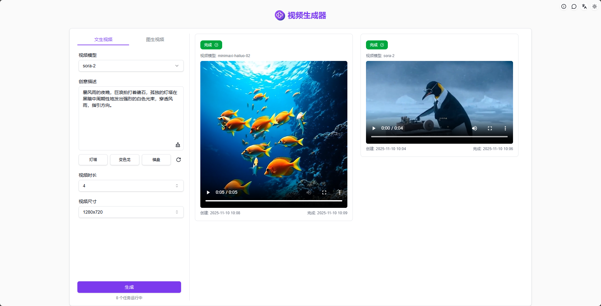
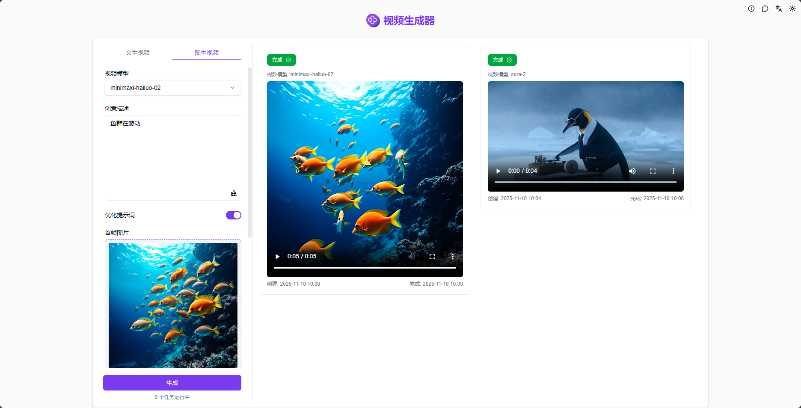
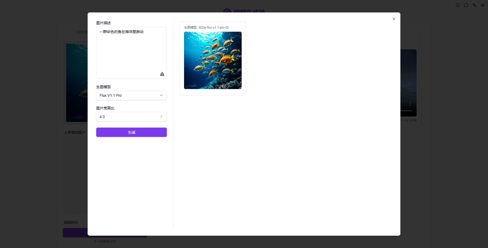

# <p align="center"> 🎬 AI 视频生成器 🚀✨</p>

<p align="center">AI视频生成器根据文本和图片，通过Luma、Runway gen-3、kling可灵、CogVideoX智谱等业内领先的视频大模型生成高质量的AI视频</p>

<p align="center"><a href="https://302.ai/product/detail/26" target="blank"></a></p >

<p align="center"><a href="README_zh.md">中文</a> | <a href="README.md">English</a> | <a href="README_ja.md">日本語</a></p>


来自[302.AI](https://302.ai)的[AI 视频生成器](https://302.ai/product/detail/26)的开源版本。你可以直接登录302.AI，零代码零配置使用在线版本。或者对本项目根据自己的需求进行修改，传入302.AI的API KEY，自行部署。

## 界面预览
选择视频模型，输入提示词并设置参数，一键生成高质量AI视频


上传本地图片或AI生图，输入提示词并设置参数，即可生成高质量AI视频
           

支持多种AI模型生成图片，一键将生成的图片用于AI视频创作
    
 
## 项目特性

### 🧩 多模型支持
    可根据不同模型提供不同配置选项，包括镜头控制、视频特效
### 🎛️ 多模式选择
    提供文生视频和图生视频两种模式，可根据个人需求进行选择
### 🖼️ AI生图
    一键生成AI图片，并将其用于视频创作
### 📜 历史记录
    保存您的创作历史,记忆不丢失，随时随地都可以下载。
### 🌓 暗色模式
    随心切换，保护您的眼睛。
### 🌐 多语言与国际化支持
  - 中文界面
  - English Interface
  - 日本語インターフェース

## 🚩 未来更新计划
- [ ] 新增更多视频模型


## 🛠️ 技术栈

- **框架**: Next.js 14
- **语言**: TypeScript
- **样式**: TailwindCSS
- **UI组件**: Radix UI
- **状态管理**: Jotai
- **表单处理**: React Hook Form
- **HTTP客户端**: ky
- **国际化**: next-intl
- **主题**: next-themes
- **代码规范**: ESLint, Prettier
- **提交规范**: Husky, Commitlint

## 开发&部署
1. 克隆项目
```bash
git clone https://github.com/302ai/302-video-generator-public
cd 302-video-generator-public
```

2. 安装依赖
```bash
pnpm install
```

3. 环境配置
```bash
cp .env.example .env.local
```
根据需要修改 `.env.local` 中的环境变量。

4. 启动开发服务器
```bash
pnpm dev
```

5. 构建生产版本
```bash
pnpm build
pnpm start
```

## ✨ 302.AI介绍 ✨
[302.AI](https://302.ai)是一个按需付费的AI应用平台，为用户解决AI用于实践的最后一公里问题。
1. 🧠 集合了最新最全的AI能力和品牌，包括但不限于语言模型、图像模型、声音模型、视频模型。
2. 🚀 在基础模型上进行深度应用开发，我们开发真正的AI产品，而不是简单的对话机器人
3. 💰 零月费，所有功能按需付费，全面开放，做到真正的门槛低，上限高。
4. 🛠 功能强大的管理后台，面向团队和中小企业，一人管理，多人使用。
5. 🔗 所有AI能力均提供API接入，所有工具开源可自行定制（进行中）。
6. 💡 强大的开发团队，每周推出2-3个新应用，产品每日更新。有兴趣加入的开发者也欢迎联系我们